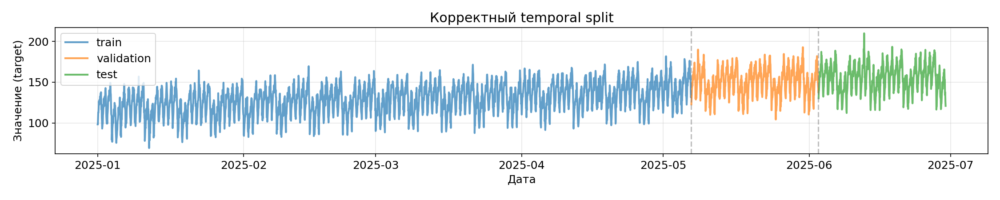
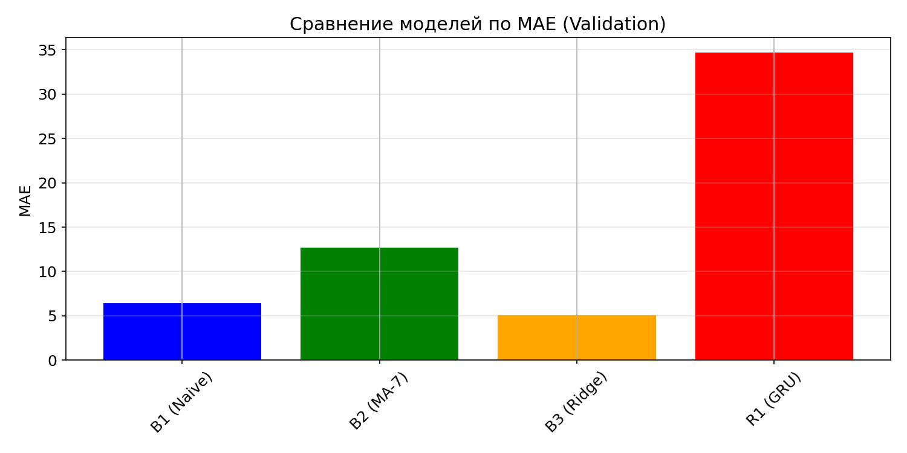
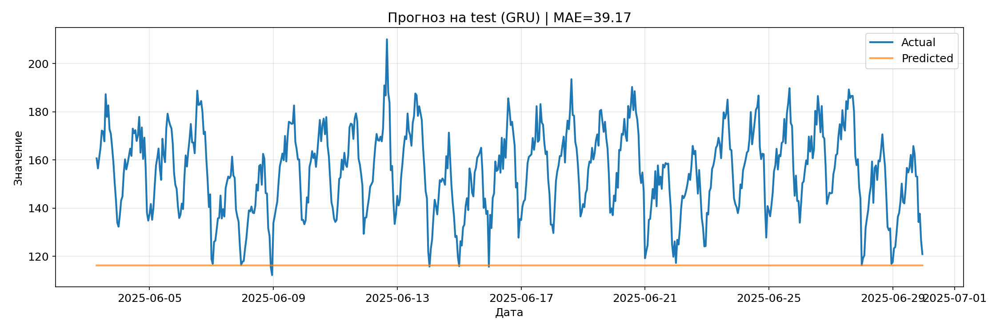
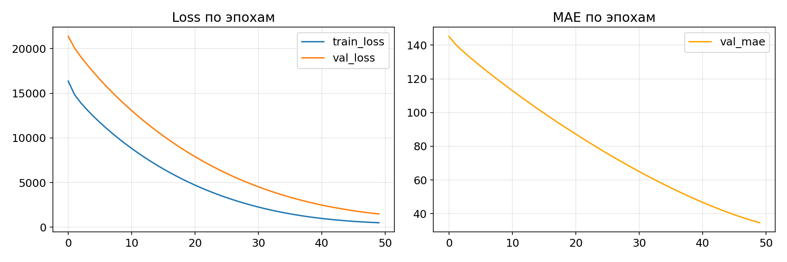

# Отчёт по HW12: Прогнозирование временных рядов

## 1. Описание данных
- Датасет: `S12-hw-dataset.csv`
- Наблюдений: N
- Период: дата_начала → дата_конца
- Частота: почасовая
- Пропуски: обработаны (forward fill / drop)

## 2. Разбиение данных
- Train: 70% (ранняя часть)
- Validation: 15% (средняя часть)
- Test: 15% (поздняя часть)

## 3. Почему random split некорректен
Для временных рядов задача: "Используя прошлое, предсказать будущее"
При random split модель обучается на будущих данных и тестируется на прошлых — это нереалистичный сценарий.

## 4. Признаки
- Лаги: lag_1, lag_7, lag_14, lag_28
- Rolling: rolling_mean_7, rolling_std_7, rolling_mean_14
- Календарные: dayofweek, month, day, hour + синус/косинус кодирование

## 5. Результаты экспериментов

| Модель | Val MAE | Val RMSE | Val MAPE | Test MAE |
|--------|---------|----------|----------|----------|
| B1 (Naive) | X | X | X | X |
| B2 (MA-7) | X | X | X | X |
| B3 (Ridge) | X | X | X | X |
| R1 (GRU) | X | X | X | X |

## 6. Лучшая модель
- Модель: [название]
- Test MAE: X
- Test RMSE: X
- Test MAPE: X%

## 7. Кривые обучения GRU

## 8. Выводы
1. Temporal split обязателен для временных рядов
2. GRU показал [лучше/хуже] baseline моделей
3. Лаговые признаки наиболее важны для прогноза

## 9. Артефакты
- [runs.csv](artifacts/runs.csv)
- [best_gru.pt](artifacts/best_gru.pt)
- [best_gru_config.json](artifacts/best_gru_config.json)